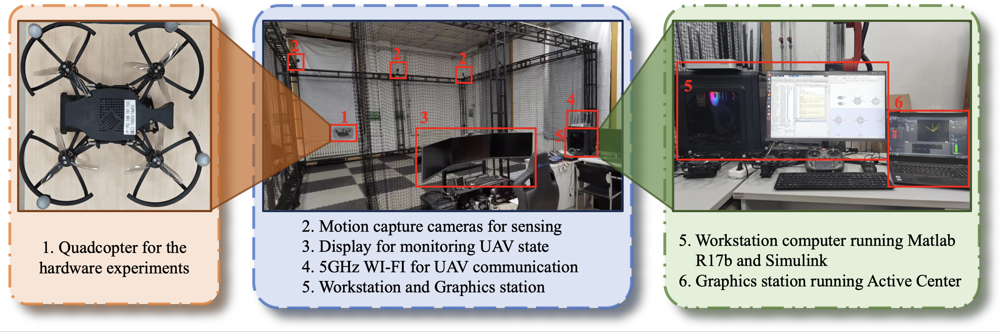
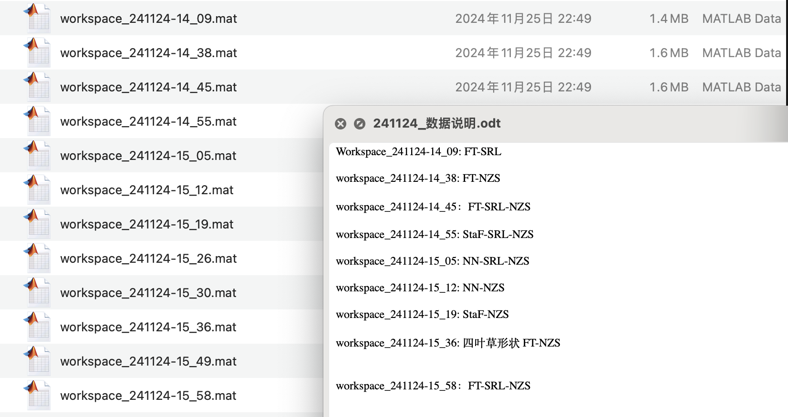
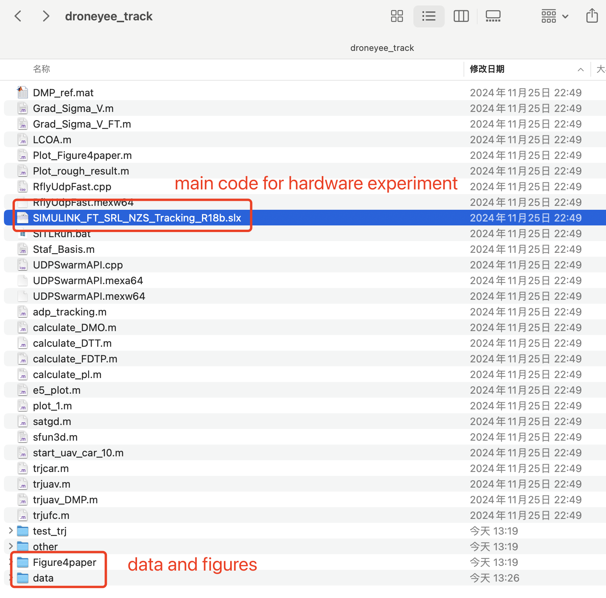

# FT-SRL-Quadcopter

<!-- # Repository for "Finite-time Safe Reinforcement Learning Control of Multi-player Nonzero-sum Game for Quadcopter Systems" -->

This repository contains the code and experimental data for our paper: ["Finite-time Safe Reinforcement Learning Control of Multi-player Nonzero-sum Game for Quadcopter Systems"](https://link.springer.com/article/10.1007/s11071-025-11021-6) published in the *Information Sciences* journal.

## Citation

If you use this code or find our research helpful, please cite our paper:

```bibtex
@article{Tan2025,
    author = {Tan, Junkai and Xue, Shuangsi and Guan, Qingshan and Qu, Kai and Cao, Hui},
    title = {Finite-time Safe Reinforcement Learning Control of Multi-player Nonzero-sum Game for Quadcopter Systems},
    journal = {Information Sciences},
    year = {2025},
    doi = {10.1016/j.ins.2024.120264}
}
```

## Overview

This project implements a finite-time safe reinforcement learning approach for quadcopter control systems in a multi-player nonzero-sum game framework. The implementation includes both hardware experiments and simulation code.



## Implementation
Hardware setup:
- X150 quadcopter with RK3566 (1.80 GHz) processor and 4GB RAM
- OptiTrack system (8 cameras) for position tracking
- Control inputs via 5GHz WiFi at 30 Hz
- Controllers computed on i7-12700 workstation

## Structure
The data folder contains the experimental data used in the paper. The code folder contains the Matlab code for the FT-SRL algorithm and the quadcopter control.




